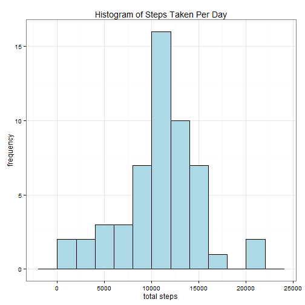
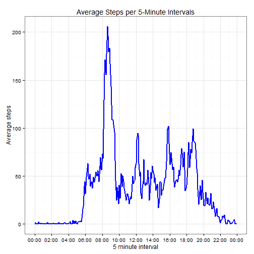
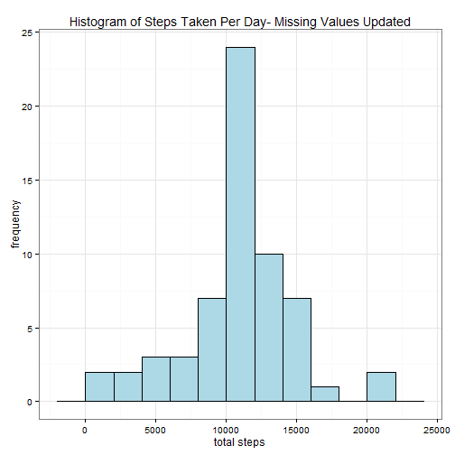
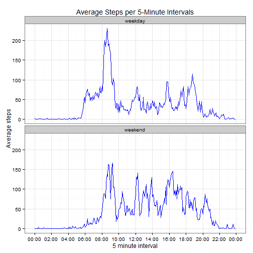

**Title: "Reproducible Research: Peer Assessment 1"**  
**Author: "yogarjun77"**  
**Date: " May 16, 2015**   
  

**Introduction**

This assignment makes use of data from a personal activity monitoring device. This device collects data at 5 minute intervals through out the day. The data consists of two months of data from an anonymous individual collected during the months of October and November, 2012 (total 61 days) and include the number of steps taken in 5 minute intervals each day.

The data for this assignment can be downloaded from here:

Dataset: [Activity monitoring data](https://d396qusza40orc.cloudfront.net/repdata%2Fdata%2Factivity.zip) [52K]  

The variables included in this dataset are:  

**steps**: Number of steps taking in a 5-minute interval (missing values are coded as NA)  

**date**: The date on which the measurement was taken in YYYY-MM-DD format  

**interval**: Identifier for the 5-minute interval in which measurement was taken  

The dataset is stored in a comma-separated-value (CSV) file and there are a total of 17,568 observations in this dataset.  

The questions answered here are relevant to understand how to prepare, deal with NA values in data and finally interpret data to come up with some basic conclusions.

**Preparation**

1. Load the necessary libraries  


```r
library(timeDate)
library(dplyr)
library(scales)
library(ggplot2)
```
2. Load the data and standardize format for date and interval  

```r
activity <- read.csv("./activity.csv", header = TRUE, sep = ",")
activity$date <- as.POSIXct(activity$date)
activity$interval <- formatC(activity$interval, width = 4, format = "d", flag = "0")
head(activity)
```

```
##   steps       date interval
## 1    NA 2012-10-01     0000
## 2    NA 2012-10-01     0005
## 3    NA 2012-10-01     0010
## 4    NA 2012-10-01     0015
## 5    NA 2012-10-01     0020
## 6    NA 2012-10-01     0025
```

**Part 1 - Mean total number of steps per day**  

1. Calculate the total steps by day and store as dataframe step_total  

```r
step_total <- activity %>%  
       group_by(date)%>%  
       summarize(total_steps = sum(steps))  
head(step_total)
```

```
## Source: local data frame [6 x 2]
## 
##         date total_steps
## 1 2012-10-01          NA
## 2 2012-10-02         126
## 3 2012-10-03       11352
## 4 2012-10-04       12116
## 5 2012-10-05       13294
## 6 2012-10-06       15420
```


2. Plot histogram of total number of steps taken per day  

```r
ggplot(data = step_total, aes(x = total_steps))+ 
   geom_histogram(colour = "black", fill = "lightblue", binwidth = 2000)+ 
   labs(x="total steps", y="frequency", title = "Histogram of Steps Taken Per Day")+
   theme_bw()
```

 

3. Calculating mean and median of total number of steps taken per day  

```r
round(mean(step_total$total_steps, na.rm = TRUE),0)
```

```
## [1] 10766
```

```r
round(median(step_total$total_steps, na.rm = TRUE),0)
```

```
## [1] 10765
```
**Part 2 - Average daily activity pattern**  

1. Time series plot of 5-minute interval vs average number of steps taken(averaged across all days)


```r
by_interval <- activity %>% 
        group_by(interval) %>% 
        summarize(avg_steps = mean(steps, na.rm = TRUE))

by_interval$interval2 <- as.POSIXct(strptime(by_interval$interval, "%H%M"))

ggplot(by_interval, aes(x=interval2, y=avg_steps)) + 
    theme_bw() + 
    geom_line(color="blue", size=1) +
    labs(x="5 minute interval", y="Average steps", title = "Average Steps per 5-Minute Intervals")+
    scale_x_datetime(breaks=date_breaks("2 hour"), labels= date_format("%H:%M"))+        
   theme_bw()  
```

 

2. 5-minute interval which contains the maximum number of steps


```r
by_interval[(which(by_interval$avg_steps == max(by_interval$avg_steps), arr.ind = TRUE)),1]
```

```
## Source: local data frame [1 x 1]
## 
##   interval
## 1     0835
```

**Part 3 - Imputing missing values**   
1. Total number of missing values in the dataset

```r
sum(is.na(activity$steps))
```

```
## [1] 2304
```

2. Use mean of 5-minute interval to fill in the missing values


```r
for(i in 1:nrow(activity)){   
if(is.na(activity$steps[i])==TRUE){   
activity$steps[i]=by_interval$avg_steps[which(by_interval$interval==activity$interval[i])] }    
}   
#note - by_interval has been created earlier in part 2 as 5-minute interval average
```
3. Updated dataset - step_total -  with missing data filled in


```r
step_total <- activity %>%
    group_by(date)%>%
    summarize(total_steps = sum(steps))   
```
3. (a) Histogram of total number of steps taken each day

```r
ggplot(data = step_total, aes(x = total_steps))+ 
   geom_histogram(colour = "black", fill = "lightblue", binwidth = 2000)+ 
   labs(x="total steps", y="frequency", title = "Histogram of Steps Taken Per Day- Missing Values Updated")+
   theme_bw()
```

 

3. (b) Mean and median total number of steps taken per day calculated below.  

```r
round(mean(step_total$total_steps),0)
```

```
## [1] 10766
```

```r
round(median(step_total$total_steps),0)
```

```
## [1] 10766
```
From the calculations, the new dataset mean and median are is similar as in Part 1 without imputing missing values - no impact. 

**Part 4 - Differences in patterns between weekdays and weekends**  

1. Creating a new factor variable in the dataset with two levels - "weekday" and "weekend".  

```r
activity$day <- weekdays(activity$date)  
activity$day <- gsub("Saturday|Sunday", "weekend", activity$day)  
activity$day <- gsub("Monday|Tuesday|Wednesday|Thursday|Friday", "weekday", activity$day)  
by_interval <- activity %>% group_by(interval, day) %>% summarize(avg_steps = mean(steps))  
by_interval$interval2 <- as.POSIXct(strptime(by_interval$interval, "%H%M"))  
head(by_interval)
```

```
## Source: local data frame [6 x 4]
## Groups: interval
## 
##   interval     day  avg_steps           interval2
## 1     0000 weekday 2.25115304 2015-05-18 00:00:00
## 2     0000 weekend 0.21462264 2015-05-18 00:00:00
## 3     0005 weekday 0.44528302 2015-05-18 00:05:00
## 4     0005 weekend 0.04245283 2015-05-18 00:05:00
## 5     0010 weekday 0.17316562 2015-05-18 00:10:00
## 6     0010 weekend 0.01650943 2015-05-18 00:10:00
```


2. Panel Time series plot of 5-minute interval vs average number of steps taken(averaged across all days) - for weekday days and weekend days.


```r
ggplot(by_interval, aes(x=interval2, y=avg_steps))+ theme_bw() + 
        geom_line(color="blue", size=0.7) + facet_wrap(~day, nrow = 2)+ 
        labs(x="5 minute interval", y="Average steps", title = "Average Steps per 5-Minute Intervals")+ 
        scale_x_datetime(breaks =date_breaks("2 hour"), labels= date_format("%H:%M"))
```

 

**Remarks/Conclusion**
The subject in this study shows significant movement above 200 steps around 8:35 am on weekdays possibly while going to work or maybe a morning jog. During weekends movement is more spread out along the day between 8am to 5pm.

The measured steps by 5-minute interval correspond to data that can be extracted from personal activity monitoring devices. R programming has successfully been utilized to process this data, identify patterns in user behavior and subsequently generate reports for further use.  

